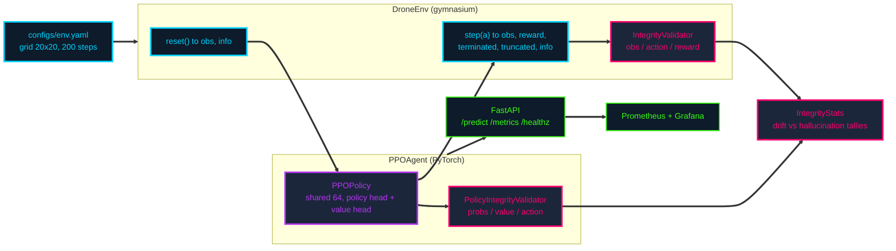

<div align="center">

<b><font size="6">Multi-Agent RL MAPF Drone Navigation</font></b>

<br/>

<a href="https://github.com/jameswniu/multi-agent-rl-mapf-drone-navigation/actions/workflows/test.yml"></a>
<a href="https://github.com/jameswniu/multi-agent-rl-mapf-drone-navigation/actions/workflows/docker.yml"></a>
<a href="https://github.com/jameswniu/multi-agent-rl-mapf-drone-navigation/actions/workflows/codeql-analysis.yml"></a>


<br/><br/>

<strong>A PPO drone-navigation agent that validates its own policy outputs at every step.</strong><br/>
The interesting part is not the controller. It is the layer watching the controller,<br/>
which separates <em>drift</em>, a number sliding out of its declared range, from<br/>
<em>hallucination</em>, an output that was never legal to begin with.

<br/>

<code>observe -> policy -> validate -> act</code>

</div>

---

## Why the validators are the point

A policy network fails quietly. It returns a number of the right type, in the right shape, at the right time, and that number is wrong. Nothing raises. A type checker sees a `float`. The training loop keeps going and the loss curve still looks reasonable.

So this repo attaches a validator to both sides of the loop and makes every step answer two separate questions:

| | question | example | means |
|---|---|---|---|
| **Drift** | Is this value still inside the range it declared? | An observation outside `observation_space`, a non-finite reward, action probabilities that stop summing to 1 | a bound was crossed |
| **Hallucination** | Was this output ever legal? | Action index `999` against a `Discrete(5)` space | a value was invented |

The distinction earns its keep because the two need different responses. Drift means a bound is wrong or a distribution is moving, so you widen, retrain, or investigate. Hallucination means the output space itself was violated, so you stop.

`IntegrityStats` tallies both across a run and prints a report at the end of training and of inference, so a run that completed is not automatically a run that was clean.

**This is not a theoretical feature.** Getting CI green on this repo surfaced a bug the validators had been reporting correctly the whole time while nobody was reading them. `observation_space` declared a single scalar upper bound of `grid_size` across all five dimensions, but the fifth dimension counts down from `max_steps`. Under the shipped config that is 200 against a bound of 20, so **every step of every episode raised an observation drift error**. The validator was right. The declared space was wrong.

---

## Architecture



<p align="center">
  
</p>

<details>
<summary><b>Low level design and reward pattern reference</b></summary>
<br/>

<p align="center">
  <br/><br/>
  
</p>

Written specs live in [`architecture/low_level_design.txt`](architecture/low_level_design.txt) and [`architecture/summary.md`](architecture/summary.md).

</details>

---

## The environment

A grid world, deliberately small, so the validator layer is the thing under test rather than the control problem.

**Observation**, a `Box` of shape `(5,)`, `float32`:

| index | field | range |
|---|---|---|
| 0, 1 | drone `x`, `y` | `0` to `grid_size - 1` |
| 2, 3 | goal `x`, `y` | `0` to `grid_size - 1` |
| 4 | `steps_remaining` | `0` to `max_steps` |

Bounds are per-dimension, for the reason described above. One scalar bound cannot describe both a coordinate and a step counter.

**Action**, `Discrete(5)`: `0` hover, `1` up, `2` down, `3` left, `4` right. Moves clamp at the grid edge, so an illegal move is absorbed rather than rejected.

**Reward**: `+10.0` on reaching the goal, `-1.0` per step otherwise. `terminated` on goal, `truncated` at `max_steps`.

**Config** ([`configs/env.yaml`](configs/env.yaml)):

```yaml
grid_size: 20
num_drones: 10
obstacle_density: 0.1
max_steps: 200
```

---

## Scope and status

Worth reading before the deployment sections. The repository name is older than the code.

| capability | status |
|---|---|
| Single-drone PPO navigation on a grid | **Implemented**, trains and runs |
| Integrity validators, drift and hallucination classification | **Implemented**, covered by tests |
| `IntegrityStats` reporting across a run | **Implemented** |
| FastAPI service, `/metrics` and `/healthz` | **Implemented** |
| Docker image, Compose, Kubernetes manifests, Prometheus and Grafana config | **Implemented** as configuration |
| `/predict` end to end | **Broken**, see Known gaps |
| Multi-agent, more than one drone | **Not implemented**. `num_drones` is read into an attribute and never used; the env tracks a single position vector |
| MAPF, multi-agent path finding | **Not implemented**. No conflict resolution, no reservation table, no joint planner |
| Obstacles | **Not implemented**. `obstacle_density` is read and never used |
| Ingestion, Preprocess and Prediction agents; Safety Controller; Supervisor | **Design only**, described in [`architecture/summary.md`](architecture/summary.md), no code in `src/` |

The multi-agent and MAPF pieces are the roadmap the name points at, not a description of `src/`.

### Known gaps

**`/predict` currently rejects every input.** The request schema declares `state: dict`, while `PPOAgent.predict` calls `torch.tensor(state)` and needs a numeric sequence. No body satisfies both:

```
{"state": [0,0,19,19,200]}   ->  422  pydantic: "Input should be a valid dictionary"
{"state": {"x": 1, "y": 2}}  ->  500  "Prediction failed: must be real number, not dict"
```

`tests/test_api.py` does not catch this, because it replaces `PPOAgent` with a stub that returns a constant. The fix is to agree on one contract, most naturally the 5-number observation vector, then make the schema and the agent match.

---

## Quickstart

Python 3.10. The editable install is required rather than optional: the project uses a `src/` layout, and the tests import `main`, `env` and `agents` as top-level modules.

```bash
git clone https://github.com/jameswniu/multi-agent-rl-mapf-drone-navigation.git
cd multi-agent-rl-mapf-drone-navigation
pip install -r requirements.txt
pip install -e .
```

Train, then run a short inference rollout:

```bash
python -m main
```

That trains for 10 episodes, writes `models/ppo_drone.pt`, and prints an integrity report for each phase:

```
Starting training for 10 episodes...
Episode 1, total reward=-200.00
...
Episode 10, total reward=-200.00
Model saved to models/ppo_drone.pt
[Training Integrity Report] Steps=2000
  - Drift errors: 0 (0.00% of steps)
  - Hallucination errors: 0 (0.00% of steps)
Step 1: action=up, reward=-1.00
...
Total reward over 5 steps = -5.00
[Inference Integrity Report] Steps=5
  - Drift errors: 0 (0.00% of steps)
  - Hallucination errors: 0 (0.00% of steps)
```

Those two zeroes are the whole point of the section above. Before the observation-space bounds were fixed, that same run reported a drift error on all 2000 of 2000 steps. Ten episodes on a 20x20 grid is far too short to reach the goal, which is why every episode returns the `-200.00` floor; the run demonstrates the validator layer, not convergence.

Serve the API:

```bash
uvicorn src.api.app:app --reload
```

```bash
curl http://localhost:8000/healthz
# {"status":"ok"}
```

`/predict` is reachable but not yet usable. See Known gaps.

---

## API

| method | path | purpose | status |
|---|---|---|---|
| `POST` | `/predict` | Greedy action from the loaded policy | Reachable, contract broken |
| `GET` | `/metrics` | Prometheus exposition format | Working |
| `GET` | `/healthz` | Liveness and readiness probe | Working |

Weights load at startup from `models/ppo_drone.pt`. If that file is absent the service logs a warning and serves an untrained policy rather than refusing to start, which is the right call for a probe endpoint and the wrong one for a prediction endpoint.

Every request passes through middleware recording `REQUEST_COUNT` and `REQUEST_LATENCY` by method and endpoint. Notes in [`docs/API.md`](docs/API.md).

---

## Testing

```bash
pytest -v
pytest --cov=src --cov-report=term-missing
```

| file | what it covers |
|---|---|
| `tests/test_integrity.py` | A legal step produces no integrity errors; the policy validator flags negative probabilities, non-finite values and out-of-space actions |
| `tests/test_training.py` | Train, save and reload, then a short greedy rollout |
| `tests/test_integration.py` | Environment and agent wired together |
| `tests/test_api.py` | `/predict` against a stubbed agent |
| `tests/test_load.py` | Repeated stepping under pressure |

Current state on `main`: 6 passing, 85 percent line coverage.

**One caveat worth knowing.** `tests/conftest.py` catches any import failure of the real `DroneEnv` and substitutes a stub. That is why a missing dependency once surfaced as `AttributeError: 'DroneEnv' object has no attribute 'reset'` instead of an import error, and why coverage sat at 38 percent while appearing to exercise the environment. The stub is still in place.

---

## Deployment

```bash
docker build -t drone-rl -f docker/Dockerfile .
docker run --rm drone-rl python -m pytest -q
```

```bash
docker compose -f docker/docker-compose.yml up
```

```bash
kubectl apply -f docker/k8s/
```

`docker/Dockerfile` installs the project editable, so the `src/` layout resolves the way it does in CI. `docker/Dockerfile.prod` takes a different route and copies `src/` to the image root; note that `src/api/app.py` imports through the `src.` prefix, so the prod image suits the training entrypoint rather than the API. Notes in [`docs/DEPLOYMENT.md`](docs/DEPLOYMENT.md).

---

## Monitoring

| surface | file |
|---|---|
| Prometheus scrape config | [`monitoring/prometheus.yml`](monitoring/prometheus.yml) |
| Grafana dashboard | [`monitoring/grafana-dashboard.json`](monitoring/grafana-dashboard.json) |
| Alertmanager routes | [`monitoring/alertmanager.yml`](monitoring/alertmanager.yml) |

Panels cover request latency p95, requests by endpoint, training reward distribution and error rate.

---

## Repository layout

```
multi-agent-rl-mapf-drone-navigation/
├── architecture/        # Design diagrams, low level specs, interview summary
├── configs/             # env.yaml, env-prod.yaml, train.yaml
├── docker/              # Dockerfile, Dockerfile.prod, compose, k8s manifests
├── docs/                # API, ARCHITECTURE, DEPLOYMENT
├── monitoring/          # Prometheus, Grafana, Alertmanager
├── scripts/             # train.sh, run_server.sh, deploy.sh
├── src/
│   ├── agents/          # ppo_agent.py: PPOPolicy, PPOAgent
│   ├── api/             # app.py: FastAPI service
│   ├── env/             # drone_env.py: DroneEnv
│   ├── utils/           # logger, metrics, errors
│   ├── integrity_validators.py
│   ├── integrity_stats.py
│   └── main.py          # train_and_save, run_inference
└── tests/
```

---

## Contributing

See [CONTRIBUTING.md](CONTRIBUTING.md).

## License

Apache-2.0. See [LICENSE](LICENSE) and [NOTICE](NOTICE).
