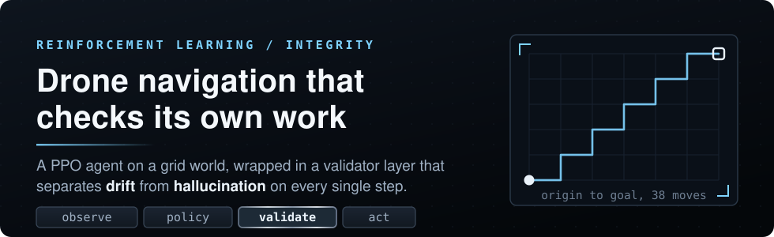
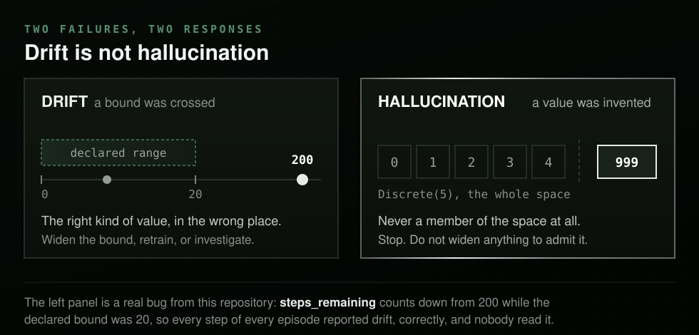
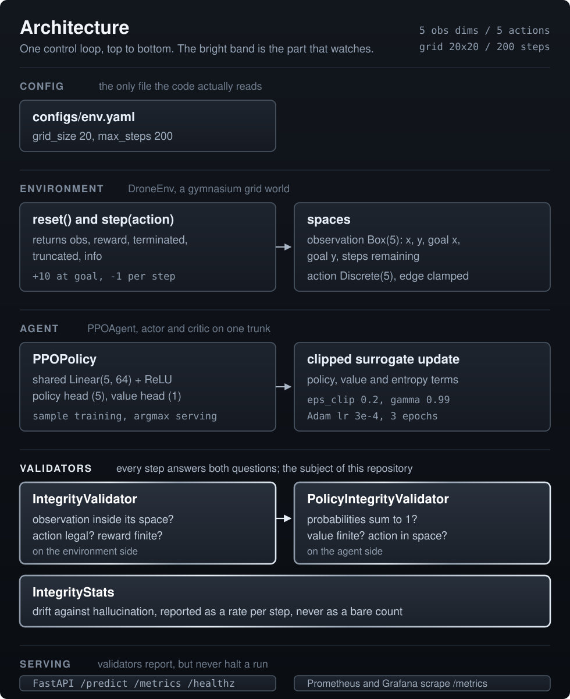
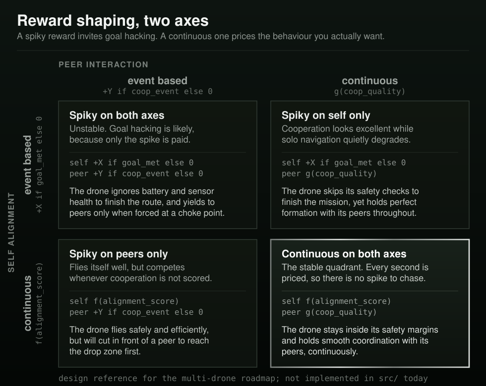
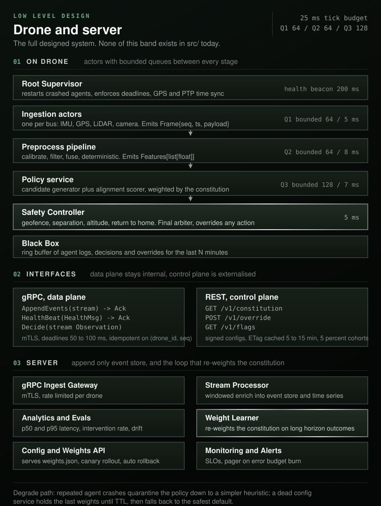

<p align="center">
  
</p>

<div align="center">

<b><font size="6">Multi-Agent RL MAPF Drone Navigation</font></b>

<br/>

<a href="https://github.com/jameswniu/multi-agent-rl-mapf-drone-navigation/actions/workflows/test.yml"></a>
<a href="https://github.com/jameswniu/multi-agent-rl-mapf-drone-navigation/actions/workflows/docker.yml"></a>
<a href="https://github.com/jameswniu/multi-agent-rl-mapf-drone-navigation/actions/workflows/codeql-analysis.yml"></a>


<br/><br/>

<strong>A PPO drone-navigation agent that validates its own policy outputs at every step.</strong><br/>
The interesting part is not the controller. It is the layer watching the controller,<br/>
which separates <em>drift</em>, a number sliding out of its declared range, from<br/>
<em>hallucination</em>, an output that was never legal to begin with.

<br/>

<code>observe -> policy -> validate -> act</code>

</div>

---

## Why the validators are the point

A policy network fails quietly. It returns a number of the right type, in the right shape, at the right time, and that number is wrong. Nothing raises. A type checker sees a `float`. The training loop keeps going and the loss curve still looks reasonable.

Reinforcement learning makes this worse than usual, because the two obvious signals both lie. Reward is delayed, so a policy can be wrong for a hundred steps before the return reflects it. And a bounded action space means an invalid decision often gets clamped into a valid one on its way to the actuator, which is exactly the case where a real drone flies and a real log stays empty.

So this repo attaches a validator to both sides of the loop and makes every step answer two separate questions:

| | question | example | means |
|---|---|---|---|
| **Drift** | Is this value still inside the range it declared? | An observation outside `observation_space`, a non-finite reward, action probabilities that stop summing to 1 | a bound was crossed |
| **Hallucination** | Was this output ever legal? | Action index `999` against a `Discrete(5)` space | a value was invented |

The distinction earns its keep because the two need different responses. Drift means a bound is wrong or a distribution is moving, so you widen, retrain, or investigate. Hallucination means the output space itself was violated, so you stop.

<p align="center">
  
</p>

**This is not a theoretical feature.** Getting CI green on this repo surfaced a bug the validators had been reporting correctly the whole time while nobody was reading them. `observation_space` declared a single scalar upper bound of `grid_size` across all five dimensions, but the fifth dimension counts down from `max_steps`. Under the shipped config that is 200 against a bound of 20, so **every step of every episode raised an observation drift error**. The validator was right. The declared space was wrong.

---

## The integrity layer

Two validators in [`src/integrity_validators.py`](src/integrity_validators.py), one per side of the loop, plus a counter in [`src/integrity_stats.py`](src/integrity_stats.py).

**`IntegrityValidator`**, attached to `DroneEnv`, runs inside `step()` and appends findings to the returned `info` dict under `integrity_errors`:

| check | classified as | note |
|---|---|---|
| `observation_space.contains(obs)` | drift | Observation is cast to the space dtype first, to avoid float32 against float64 false positives |
| Observation fails to cast at all | drift | Reported as a malformed observation rather than an out-of-range one |
| `action_space.contains(int(action))` | hallucination | |
| `np.isfinite(reward)` | drift | Catches `NaN` and `inf` rewards |

**`PolicyIntegrityValidator`**, attached to `PPOAgent`, runs on every `select_action` and `predict`:

| check | classified as | tolerance |
|---|---|---|
| Any action probability below zero | drift | strict |
| Probabilities sum to 1 | drift | `atol` of `1e-2`, tightening to `1e-5` when constructed with `strict=True` |
| Value estimate is finite | drift | catches a diverged critic |
| Chosen action index is inside the action space | hallucination | |

**`IntegrityStats`** tallies both streams and prints a rate rather than a raw count, because a count is meaningless without a denominator:

```
[Training Integrity Report] Steps=2000
  - Drift errors: 0 (0.00% of steps)
  - Hallucination errors: 0 (0.00% of steps)
```

The validators report and continue; they do not halt a run. That is a deliberate choice for a training loop and the wrong one for a flight controller, which is what the Safety Controller in the roadmap is for.

---

## Architecture

The control loop is small. The validators hang off both halves of it, and everything they find funnels into one counter.

<p align="center">
  
</p>

<details>
<summary>Same diagram as text</summary>

```text
  CONFIG       configs/env.yaml            grid_size 20, max_steps 200
                    |
  ENVIRONMENT  DroneEnv (gymnasium)
                    |  reset() / step(action)  ->  obs, reward, terminated, truncated, info
                    |  observation   Box(N, 9)     per drone: x, y, goal_x, goal_y,
                    |                              steps_remaining, blocked u/d/l/r
                    |  action        MultiDiscrete one move per drone
                    |  conflicts     vertex, swap and stationary, all refused
                    v
  AGENT        PPOAgent (PyTorch)
                    |  PPOPolicy     shared Linear(5,64)+ReLU  ->  policy head (5), value head (1)
                    |  update        clipped surrogate, eps_clip 0.2, gamma 0.99, Adam 3e-4
                    |  act           sample while training, argmax at inference
                    v
  VALIDATORS   the subject of this repository
                    |  IntegrityValidator         obs in space? action legal? reward finite?
                    |  PolicyIntegrityValidator   probs sum to 1? value finite? action in space?
                    |  IntegrityStats             drift vs hallucination, as a rate per step
                    v
  SERVING      FastAPI  /predict /metrics /healthz  ->  Prometheus + Grafana
               weights load once from models/ppo_drone.pt
```

</details>

The bright band is the subject of this repository. Everything else is scaffolding around it.

The original hand-drawn design panoramas are kept in [`architecture/`](architecture/) for provenance. They are not shown here because they were drawn far too wide to read at README scale; the diagrams above are reconstructions of the same material.

---

## The environment

A grid world, deliberately small, so the validator layer is the thing under test rather than the control problem.

**Observation**, a `Box` of shape `(num_drones, 9)`, `float32`. One row per drone, so a single drone is the degenerate case of the same shape:

| index | field | range |
|---|---|---|
| 0, 1 | drone `x`, `y` | `0` to `grid_size - 1` |
| 2, 3 | goal `x`, `y` | `0` to `grid_size - 1` |
| 4 | `steps_remaining` | `0` to `max_steps` |
| 5 to 8 | blocked up, down, left, right | `0` or `1` |

The blocked flags fold three facts into one signal: a wall, an obstacle, and another drone all read as impassable, because from a drone's point of view they are the same fact.

The last four are local sensing, in action order. They exist because blocking movement alone is useless: a drone that cannot see an obstacle before hitting it cannot learn to route around one, so obstacles would be nothing but a tax on a blind policy. A grid edge reads as blocked too.

Bounds are per-dimension, for the reason described above. One scalar bound cannot describe both a coordinate and a step counter.

**Action**, `MultiDiscrete([5] * num_drones)`, one move per drone:

| index | action | effect |
|---|---|---|
| `0` | hover | position unchanged |
| `1` | up | `y + 1`, clamped at `grid_size - 1` |
| `2` | down | `y - 1`, clamped at `0` |
| `3` | left | `x - 1`, clamped at `0` |
| `4` | right | `x + 1`, clamped at `grid_size - 1` |

Moves clamp at the grid edge, so an illegal move is absorbed rather than rejected. `action_map` carries the human-readable names.

**Reward**: summed across the fleet. Per drone, `+10.0` at its goal, `-2.0` for a refused move, `-1.0` otherwise. `terminated` on goal, `truncated` at `max_steps`. The agent starts at the origin and the goal sits at the far corner, so the shortest unobstructed path under this config is 38 moves. A collision costs more than a wasted step; if it cost the same, nothing would tell the policy to route around anything.

That shipped reward is deliberately spiky: the goal bonus is an event, not a gradient. It is the top left quadrant below, and it is the cheapest thing that works for a single drone. Once more than one drone shares the grid, the quadrant matters, because a spike is exactly what a policy learns to farm.

<p align="center">
  
</p>

<details>
<summary>Same diagram as text</summary>

```text
                          PEER INTERACTION
                  event based            continuous
                  +Y if coop_event       g(coop_quality)
  SELF
  ALIGNMENT
  event based     Spiky on both axes     Spiky on self only
  +X if goal_met  unstable, goal         cooperation looks good,
                  hacking likely         solo flight degrades

  continuous      Spiky on peers only    Continuous on both axes
  f(alignment)    flies itself well,     the stable quadrant,
                  competes with peers    no spike left to chase
```

</details>

This is a design reference for the multi-drone roadmap, not something `src/` implements today.

---

## The PPO agent

An actor-critic with a shared trunk, in [`src/agents/ppo_agent.py`](src/agents/ppo_agent.py). Small on purpose: the point of the repo is the validation layer around it.

```
observation (5)
      |
   Linear(5, 64) + ReLU          shared trunk
      |
      +---- Linear(64, 5) + Softmax    policy head, action distribution
      |
      +---- Linear(64, 1)              value head, state baseline
```

The update is standard clipped-surrogate PPO:

| term | value | role |
|---|---|---|
| Policy loss | `-min(r * A, clip(r, 1 - eps, 1 + eps) * A)` | the clip stops a single batch from moving the policy too far |
| Value loss | `0.5 * MSE(return, value)` | trains the baseline |
| Entropy bonus | `-0.01 * entropy` | keeps the distribution from collapsing early |

Returns are discounted, then normalized. Advantages are normalized again after subtracting the baseline. Both use an `1e-8` epsilon in the denominator.

**Hyperparameters** are currently Python defaults on `PPOAgent.__init__`, not configuration. See Known gaps.

| parameter | value |
|---|---|
| `lr` | `3e-4`, Adam |
| `gamma` | `0.99` |
| `eps_clip` | `0.2` |
| `epochs` | `3` update passes per episode |

`select_action` samples from the distribution for exploration during training. `predict` takes the argmax for inference. Both run the policy validator before returning.

---

## Configuration

Only one config file is actually read by the code today.

| file | read by | status |
|---|---|---|
| [`configs/env.yaml`](configs/env.yaml) | `DroneEnv._load_config` | **Live** |
| [`configs/train.yaml`](configs/train.yaml) | `main.load_train_config` | **Live**, via `--config` |
| [`configs/env-prod.yaml`](configs/env-prod.yaml) | nothing | **Dead** |
| `.env` (see [`.env.example`](.env.example)) | `scripts/run_server.sh` only | Shell-level. No Python module reads an environment variable |

```yaml
# configs/env.yaml, the one that is loaded
grid_size: 20
num_drones: 10          # fleet size; each gets its own start and goal
obstacle_density: 0.1   # obstacle rate per cell, start and goal always clear
max_steps: 200
```

`DroneEnv` resolves a relative config path against the repository root, so it works the same from the repo root, from `src/`, and inside the container. If PyYAML is missing it falls back to a minimal line parser rather than failing.

---

## Request lifecycle

What happens on a call to the service, from [`src/api/app.py`](src/api/app.py):

1. `add_metrics` middleware stamps a start time.
2. The route runs. `/predict` hands the payload to `PPOAgent.predict`; failures are wrapped as `APIError` and rendered as `{"error": "..."}` with status 500.
3. The middleware records `REQUEST_COUNT` and `REQUEST_LATENCY`, both labelled by method and endpoint, then logs a line like `POST /predict completed in 0.032s`.
4. Prometheus scrapes `GET /metrics`; the orchestrator polls `GET /healthz`.

Weights load once at startup from `models/ppo_drone.pt`. If that file is absent the service logs a warning and serves an untrained policy rather than refusing to start, which is the right call for a probe endpoint and the wrong one for a prediction endpoint.

---

## Scope and status

Worth reading before the deployment sections. The repository name is older than the code.

| capability | status |
|---|---|
| Single-drone PPO navigation on a grid | **Implemented**, trains and runs |
| Integrity validators, drift and hallucination classification | **Implemented**, covered by tests |
| `IntegrityStats` reporting across a run | **Implemented** |
| FastAPI service, `/metrics` and `/healthz` | **Implemented** |
| Docker image, Compose, Kubernetes manifests, Prometheus and Grafana config | **Implemented** as configuration |
| `/predict` end to end | **Implemented**. Takes the 5-number observation vector |
| Hyperparameters from `configs/train.yaml` | **Implemented**. Loaded and applied to `PPOAgent` |
| Multi-agent, more than one drone | **Implemented**. `num_drones` sets the fleet; shared policy weights across drones |
| MAPF, multi-agent path finding | **Implemented**. Vertex, swap and stationary conflicts detected and refused each step |
| Obstacles | **Implemented**. Drawn from `obstacle_density`, refuse movement, and are locally sensed |
| Ingestion, Preprocess and Prediction agents; Safety Controller; Supervisor | **Design only**, described in [`architecture/summary.md`](architecture/summary.md), no code in `src/` |

The name now describes the code: multiple drones share one grid, see each other, and have their conflicting moves refused. What remains is the Safety Controller, the first component that would be allowed to veto rather than only report.

### The designed system

The repository carries a full low level design that `src/` has never implemented. It is worth reading as intent, and worth being explicit that it is intent: the actor pipeline, the bounded queues, the safety arbiter and the server side re-weighting loop are all design, not code.

<p align="center">
  
</p>

<details>
<summary>Same diagram as text</summary>

```text
  ON DRONE                                            budget: 25 ms per tick
    Root Supervisor        restarts, deadlines, time sync    beacon 200 ms
         |
    Ingestion actors       IMU, GPS, LiDAR, camera           Q1  64    5 ms
         |                 Frame{seq, ts, payload}
    Preprocess pipeline    calibrate, filter, fuse           Q2  64    8 ms
         |                 Features[list[float]]
    Policy service         candidates + alignment scorer     Q3 128    7 ms
         |                 weighted by the constitution
    Safety Controller      geofence, separation, altitude,             5 ms
         |                 return to home. Final arbiter.
    Black Box              ring buffer, last N minutes

  INTERFACES
    gRPC, data plane       AppendEvents / HealthBeat / Decide
                           mTLS, deadlines 50 to 100 ms
    REST, control plane    GET /v1/constitution, POST /v1/override,
                           GET /v1/flags. Signed, ETag cached.

  SERVER
    Ingest Gateway  ->  Stream Processor  ->  Event Store + time series
                                          ->  Analytics and Evals
                                          ->  Weight Learner
                                          ->  Config and Weights API
```

</details>

Full written spec in [`architecture/low_level_design.txt`](architecture/low_level_design.txt).

### Known gaps

**`tests/conftest.py` swallows import errors.** It catches any failure importing the real `DroneEnv` and substitutes a stub. That is why a missing dependency once surfaced as `AttributeError: 'DroneEnv' object has no attribute 'reset'` rather than an import error, and why coverage sat at 38 percent while appearing to exercise the environment.

### Roadmap

Roughly in dependency order:

1. Safety Controller, the first component allowed to veto rather than only report.
2. A learned conflict policy: today conflicts are refused, which is correct but blunt. Yielding by priority or by remaining distance would be a real coordination signal.

Done: multiple drones share the grid with vertex, swap and stationary conflicts refused, obstacles are generated and sensed, the `/predict` contract now takes the 5-number observation vector and is covered by tests that do not stub the agent, and `configs/train.yaml` is loaded and applied rather than silently discarded.

---

## Quickstart

Python 3.10. The editable install is required rather than optional: the project uses a `src/` layout, and the tests import `main`, `env` and `agents` as top-level modules.

```bash
git clone https://github.com/jameswniu/multi-agent-rl-mapf-drone-navigation.git
cd multi-agent-rl-mapf-drone-navigation
pip install -r requirements.txt
pip install -e .
```

Train, then run a short inference rollout:

```bash
python -m main
```

That trains for 10 episodes, writes `models/ppo_drone.pt`, and prints an integrity report for each phase:

```
Starting training for 10 episodes...
Episode 1, total reward=-200.00
...
Episode 10, total reward=-200.00
Model saved to models/ppo_drone.pt
[Training Integrity Report] Steps=2000
  - Drift errors: 0 (0.00% of steps)
  - Hallucination errors: 0 (0.00% of steps)
Step 1: action=up, reward=-1.00
...
Total reward over 5 steps = -5.00
[Inference Integrity Report] Steps=5
  - Drift errors: 0 (0.00% of steps)
  - Hallucination errors: 0 (0.00% of steps)
```

Those two zeroes are the whole point of the section above. Before the observation-space bounds were fixed, that same run reported a drift error on all 2000 of 2000 steps. Ten episodes on a 20x20 grid is far too short to reach a goal 38 moves away, which is why every episode returns the `-200.00` floor; the run demonstrates the validator layer, not convergence.

Serve the API:

```bash
uvicorn src.api.app:app --reload
```

```bash
curl http://localhost:8000/healthz
# {"status":"ok"}
```

```bash
curl -X POST http://localhost:8000/predict \
  -H "Content-Type: application/json" \
  -d '{"state": [[0, 0, 19, 19, 200, 1, 1, 1, 0]]}'   # one row per drone
# {"actions":[4],"action_names":["right"]}
```

---

## API

| method | path | purpose | status |
|---|---|---|---|
| `POST` | `/predict` | Greedy action from the loaded policy | Working |
| `GET` | `/metrics` | Prometheus exposition format | Working |
| `GET` | `/healthz` | Liveness and readiness probe | Working |

Notes in [`docs/API.md`](docs/API.md).

---

## Testing

```bash
pytest -v
pytest --cov=src --cov-report=term-missing
```

| file | what it covers |
|---|---|
| `tests/test_integrity.py` | A legal step produces no integrity errors; the policy validator flags negative probabilities, non-finite values and out-of-space actions |
| `tests/test_training.py` | Train, save and reload, then a short greedy rollout |
| `tests/test_integration.py` | Environment and agent wired together |
| `tests/test_api.py` | `/predict` against the real agent: a legal action, and 422 for a wrong-length or mapping body |
| `tests/test_main_config.py` | `--config` is parsed, applied to `PPOAgent`, and unknown flags exit non-zero |
| `tests/test_obstacles.py` | Density, determinism, refused moves, the collision penalty, and the sensor flags |
| `tests/test_multi_drone.py` | Fleet contract, distinct starts and goals, and the three conflict kinds |
| `tests/test_load.py` | Repeated stepping under pressure |

Current state: 33 passing, 87 percent line coverage.

---

## Continuous integration

Three workflows, all on push and pull request against `main`.

| workflow | what it does |
|---|---|
| [`test.yml`](.github/workflows/test.yml) | Python 3.10, installs requirements and the package editable, runs `pytest -v` |
| [`docker.yml`](.github/workflows/docker.yml) | Builds `docker/Dockerfile`, then runs the suite inside the image |
| [`codeql-analysis.yml`](.github/workflows/codeql-analysis.yml) | CodeQL static analysis for Python |

`_ci-cd.yml` is a manual `workflow_dispatch` duplicate of `test.yml`. The Docker job matters because it catches packaging problems the plain test job cannot: it is the job that proves the image can import the `src/` layout at all.

---

## Deployment

```bash
docker build -t drone-rl -f docker/Dockerfile .
docker run --rm drone-rl python -m pytest -q
```

```bash
docker compose -f docker/docker-compose.yml up
```

```bash
kubectl apply -f docker/k8s/
```

`docker/Dockerfile` installs the project editable, so the `src/` layout resolves the way it does in CI. `docker/Dockerfile.prod` takes a different route and copies `src/` to the image root; note that `src/api/app.py` imports through the `src.` prefix, so the prod image suits the training entrypoint rather than the API. Notes in [`docs/DEPLOYMENT.md`](docs/DEPLOYMENT.md).

---

## Monitoring

| surface | file |
|---|---|
| Prometheus scrape config | [`monitoring/prometheus.yml`](monitoring/prometheus.yml) |
| Grafana dashboard | [`monitoring/grafana-dashboard.json`](monitoring/grafana-dashboard.json) |
| Alertmanager routes | [`monitoring/alertmanager.yml`](monitoring/alertmanager.yml) |

Panels cover request latency p95, requests by endpoint, training reward distribution and error rate.

[`src/utils/metrics.py`](src/utils/metrics.py) declares three collectors, but only two are ever written:

| collector | emitted |
|---|---|
| `api_requests_total` | Yes, by the middleware on every request |
| `api_request_latency_seconds` | Yes, by the middleware on every request |
| `training_reward` | **No.** Declared and never observed, so the training reward panel has no series behind it. The training loop prints episode reward to stdout instead |

---

## Repository layout

```
multi-agent-rl-mapf-drone-navigation/
├── architecture/        # Design diagrams, low level specs, interview summary
├── configs/             # env.yaml (live), train.yaml and env-prod.yaml (not yet wired)
├── docker/              # Dockerfile, Dockerfile.prod, compose, k8s manifests
├── docs/                # API, ARCHITECTURE, DEPLOYMENT
├── monitoring/          # Prometheus, Grafana, Alertmanager
├── scripts/             # train.sh, run_server.sh, deploy.sh
├── src/
│   ├── agents/          # ppo_agent.py: PPOPolicy, PPOAgent
│   ├── api/             # app.py: FastAPI service
│   ├── env/             # drone_env.py: DroneEnv
│   ├── utils/           # logger, metrics, errors
│   ├── integrity_validators.py
│   ├── integrity_stats.py
│   └── main.py          # train_and_save, run_inference
└── tests/
```

---

## Contributing

See [CONTRIBUTING.md](CONTRIBUTING.md).

## License

Apache-2.0. See [LICENSE](LICENSE) and [NOTICE](NOTICE).
