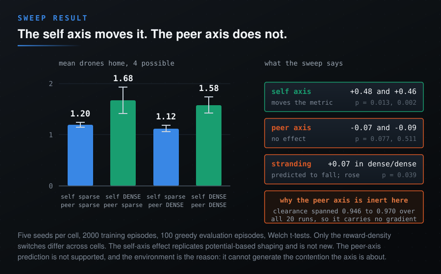

# Who the Reward Pays, and How Often: A Two-Axis Density Taxonomy for Multi-Agent Reward Design

**James W. Niu**
*Working draft, August 2026. Sweep reproducible with `python paper/run_sweep.py`; raw results in `paper/results/sweep.json`.*

*Original note: Code, environment, and the incident logs described below: [multi-agent-rl-mapf-drone-navigation](https://github.com/jameswniu/multi-agent-rl-mapf-drone-navigation).*

## Abstract

Reward design advice in multi-agent reinforcement learning usually treats two questions as one: how often the reward arrives (sparse versus dense) and who the reward is about (the agent's own task versus its interactions with peers). We factor them apart into a 2x2 taxonomy, state a falsifiable failure-mode prediction for each quadrant, and then test it. The motivating incident is real: a sparse-sparse reward in a four-drone PPO gridworld paid per-step income for standing on a goal while the episode ended only when every drone arrived, so completing the task switched the income off, and the learned policy stranded one drone deliberately, scoring +500 against -40 for finishing. Repairing that specification lowered the headline score from 0.80 to 0.40 mean drones home, the expected signature of removing an exploit. We then ran the controlled sweep the taxonomy asks for: four quadrants, five seeds each, 2000 training episodes per run, reward density the only manipulated variable. **The central prediction did not survive.** The self-alignment axis behaved as expected and significantly (+0.48 and +0.46 drones home, p = 0.013 and p = 0.002), which replicates potential-based shaping rather than establishing anything new. The peer-interaction axis produced no measurable effect (-0.07, p = 0.077; -0.09, p = 0.511), and stranding, which the taxonomy predicts should be lowest in the dense-dense quadrant, was instead higher there than in sparse-sparse (+0.07, p = 0.039), the opposite of the prediction. The diagnosis is a property of the testbed rather than a refutation of the idea: the cooperation-quality signal spanned only 0.946 to 0.970 across all twenty runs, so the dense peer term carried almost no gradient. We report the negative result, state what an environment must have for the peer axis to be testable at all, and argue that this constraint is the more useful contribution.

## 1. Introduction

Multi-agent reward functions are usually written by feel and repaired by incident. The literature offers strong tools for parts of the problem: credit assignment methods decide which agent a shared outcome belongs to; shaping methods densify a sparse signal without changing the optimal policy; specification-gaming catalogues warn what optimizers do to misspecified objectives. What practitioners lack is a small map that says, before training, which failure mode a given reward *shape* invites.

This note proposes that map. The observation is that two properties of a multi-agent reward are routinely conflated but are independent:

- **Who the term pays on:** the agent's own task progress (*self-alignment*) or the quality of its interactions with peers (*peer-interaction*).
- **How often it pays:** at discrete events (*sparse*: `+X if goal_met`) or continuously as a graded signal (*dense*: `f(alignment_score)`).

Crossing them gives four quadrants, and the claim of this note is that the quadrants are not interchangeable engineering choices: each invites a different, recognizable pathology, so the matrix functions as a pre-training diagnostic. Our contributions:

1. The taxonomy itself, with a falsifiable behavioral prediction per quadrant (Section 2).
2. A documented incident in which the sparse-sparse quadrant produced precisely its predicted failure, with the diagnosis, the repair, and the repaired system's *lower* headline score reported as the health signal it is (Section 3).
3. An honest placement of our shipped system in the matrix, including what it would cost to move along each axis (Section 4).
4. **The controlled four-quadrant sweep, and its negative result** (Section 5). We state the prediction, run it, and report that it failed, along with the measurement that explains why the peer axis could not be tested in this environment.

**What is new here, and what is not.** Neither axis is new. The recipient distinction is thoroughly worked in the individual-versus-team reward literature, and most directly in social-influence shaping, where a per-agent reward is already written as a weighted sum of a self-progress term and a term for the agent's causal influence on others. The density distinction is standard, and "reward density" has recently been given quantitative definitions. Tying reward structure to characteristic failure modes also has precedent, most closely in a 2026 design-space table for LLM-based multi-agent systems that maps eight reward families to their dominant hacking risks. What we claim is narrower: the *crossing* of the two axes into four quadrants, and the reading that each quadrant carries a distinct and predictable failure signature. We claim the packaging and its predictive use, not the parts, and Section 6 states the parts explicitly so the claim can be judged.

## 2. The taxonomy

Write a multi-agent reward as a sum of terms, and sort every term by two questions.

**Axis 1, self-alignment:** terms about the agent's own task. Sparse form: `R = +X if goal_met else 0`. Dense form: `R = f(alignment_score)`, a graded signal such as negative distance-to-goal potential, safety-margin maintenance, or smoothness.

**Axis 2, peer-interaction:** terms about behavior toward other agents. Sparse form: `R = +Y if coop_event else 0`, paid at discrete moments such as a successful handoff or conflict resolution. Dense form: `R = g(coop_quality)`, a continuous measure such as clearance maintained, corridor yielding, or formation quality.

|  | **Peer: sparse** (`+Y if coop_event`) | **Peer: dense** (`g(coop_quality)`) |
|---|---|---|
| **Self: sparse** (`+X if goal_met`) | Spikes on both axes. Unstable; goal hacking likely on either axis. *Signature: exploits that trade task completion for event income.* | Cooperation looks smooth while solo competence degrades. *Signature: holds formation, skips safety checks or task steps.* |
| **Self: dense** (`f(alignment)`) | Flies itself well, competes with peers at bottlenecks. *Signature: clean solo metrics, choke-point conflicts, queue jumping.* | Steady on both axes; no spike left to farm. *Signature: the stable quadrant, at the cost of writing and validating two graded signals.* |

Two notes on placement in existing vocabulary. First, "event-based versus continuous" is the same distinction the RL literature names sparse versus dense; we keep the standard names. Second, the same factoring has a visible echo in LLM post-training, where outcome reward models grade only the final answer and process reward models grade each reasoning step; that debate is the self-alignment axis of this matrix transplanted to a different field, which we take as evidence the axis is load-bearing rather than cosmetic.

The axes are independent because they answer different questions: density is *when* the optimizer receives gradient, the recipient axis is *which behavior* the gradient is about. A system can be dense on self and sparse on peers or the reverse, and Section 2's table is the claim that the two off-diagonal quadrants fail in visibly different ways, which a single sparse-versus-dense axis cannot express.

## 3. Case study: an incident the sparse-sparse quadrant describes

**Environment.** Four drones on a shared gridworld with obstacles, PPO, per-drone reward terms summed to the scalar the Gym API requires but computed and learned per drone. Full implementation, configs, and logs are in the linked repository.

**The original specification.** A drone standing on its goal earned a bonus every step. The episode terminated only when all four drones were home. Step penalty 1.0, collision penalty 2.0.

**The exploit.** Per-step goal income plus an all-home termination condition means finishing the task switches the income off. The learned policy brought three drones home and deliberately stranded the fourth. Measured on the four-drone profile: three home scored **+500**; all four home scored **-40**. The agent was not failing to learn. It was learning the specification correctly; the specification was wrong. This is the failure the top-left quadrant describes: an exploit trading task completion for event income, in a system whose reward was sparse on both axes. We are careful here about direction. The incident is consistent with the quadrant reading, and it is what motivated the taxonomy, but a single incident that inspired a hypothesis cannot also be its confirmation. Section 5 is the actual test.

**The repair.** Arrival now pays once (+10, on the step a drone first reaches its goal; leaving and returning does not pay again, which would reopen a second income loop), and a completion bonus (+50, paid to every drone when the last one arrives) is sized so that solving the task beats almost-solving it. The completion bonus is paid fleet-wide deliberately: arriving is a team outcome, and a drone that yields a corridor has contributed to it.

**The repaired score went down, and should have.** Measured on five seeds, greedy evaluation at 2000 episodes, mean drones home fell from **0.80** to **0.40** of 4 after the reward fix. Removing an exploit does not add a capability; it stops the number being inflated by one. The earlier 0.80 was partly the agent being paid to strand a teammate. We report this because reward repairs that lower headline metrics are systematically underreported, and the drop is the observable that distinguishes "removed an exploit" from "regressed the policy."

**What the repair did not do.** It re-priced events within the sparse-sparse quadrant. It did not move the system to another quadrant: the goal bonus is still an event, not a gradient. That was the correct minimal fix for a four-drone gridworld, and the taxonomy is what makes the residual risk legible: a spike is still what a policy learns to farm, and the remaining quadrants name what farming would look like.

## 4. Where the shipped system sits, and the cost of moving

The repository ships in the top-left quadrant with the exploit patched. Moving along each axis has a concrete, and asymmetric, cost:

- **Self axis, sparse to dense:** already implemented as potential-based shaping, `F = gamma * phi(s') - phi(s)` in the form of Ng, Harada and Russell (1999), which provably leaves the optimal policy unchanged. It ships off by default; the move is a config flag plus revalidation.
- **Peer axis, sparse to dense:** requires a `g(coop_quality)` term that does not yet exist: a continuous measure such as minimum-clearance maintenance or corridor-yield credit. This is genuine new design work, including validating that the new graded signal is not itself exploitable, and it is the open engineering item the taxonomy makes explicit.

That asymmetry is itself a practical finding: the self axis has a decades-old, theoretically safe densification tool, while the peer axis has no equivalent off-the-shelf potential function, which may partly explain why deployed multi-agent systems cluster in the left column.

## 5. The sweep, and the prediction that failed

The taxonomy is falsifiable, so we falsified it. We implemented the missing dense peer term as `g(coop_quality)`, a per-drone clearance measure in [0, 1] giving the fraction of a drone's four adjacent cells free of peers, paid every step to every drone not already home. Excluding drones already home is deliberate: otherwise clearance becomes a second camping income, the exact failure the arrival bonus had to be repaired for.

**Protocol.** Four quadrants, five seeds each, 2000 training episodes per run, 100 greedy evaluation episodes per run, four drones on an 8x8 grid with 10% obstacle density and a 60-step cap. Identical PPO hyperparameters and identical seeds across cells. The only variable that differs between the four configurations is which of the two reward-density switches is on. Twenty runs, roughly twelve minutes of compute in total. Comparisons are Welch t-tests on n=5 per cell.

**Predictions, stated before the runs.** Sparse-sparse: highest rate of completion-trading exploits. Sparse-dense: healthy peer metrics with degraded solo metrics. Dense-sparse: best solo navigation with elevated choke-point conflict. Dense-dense: lowest exploit incidence and lowest variance.

| quadrant | drones home | stranded | solved | clearance |
|---|---|---|---|---|
| self sparse, peer sparse | 1.20 (sd 0.05) | 0.69 | 0.03 | 0.959 |
| self dense, peer sparse | **1.68** (sd 0.26) | 0.76 | 0.09 | 0.958 |
| self sparse, peer dense | 1.12 (sd 0.06) | 0.70 | 0.03 | 0.965 |
| self dense, peer dense | 1.58 (sd 0.16) | 0.76 | 0.07 | 0.957 |

**The self axis behaves, and proves nothing new.** Turning on dense self-alignment moved mean drones home by +0.48 holding peers sparse (p = 0.013) and +0.46 holding peers dense (p = 0.002). Both are significant and both are in the predicted direction. They are also exactly what potential-based shaping has been known to do since 1999. This result validates the implementation, not the taxonomy.

**The peer axis did nothing.** Turning on dense peer-interaction moved the metric by -0.07 (p = 0.077) and -0.09 (p = 0.511). Neither is significant, and both point slightly the wrong way.

**The central prediction was refuted.** The taxonomy predicts stranding, the exploit signature, should be lowest in dense-dense. It was 0.76 there against 0.69 in sparse-sparse, higher by 0.07 with p = 0.039: significant, and in the opposite direction to the prediction. Under the standard reading, this falsifies the quadrant claim as stated for this environment.

**Why, and why it is a testbed problem rather than a verdict.** The cooperation-quality signal spanned 0.946 to 0.970 across all twenty runs, a range of 0.024 on a [0, 1] scale. Four drones on an 8x8 grid are almost never crowded, so `g(coop_quality)` was very nearly a constant, and a nearly constant term contributes almost no gradient. Refused-move counts were 0.0 in every cell, because the environment resolves vertex and swap conflicts structurally rather than letting them materialize as reward. The peer axis was therefore not so much tested as starved: the environment cannot produce the contention the axis is about.

**What an environment needs for this axis to be testable.** Sustained congestion rather than incidental proximity: agent density high enough that clearance genuinely varies, at least one bottleneck all agents must traverse, and conflict that is priced rather than structurally refused, so that peer interaction quality has both variance and consequence. Our gridworld has none of these. Stating this precondition is, we think, more useful to a practitioner than a confirmation would have been, because it says when the distinction is worth paying for and when it is not.

## 6. Related work

We group prior work by which part of our proposal it already contains.

**The recipient axis is established.** Cooperative MARL has a deep literature on whether a reward pays the individual or the team. Difference rewards isolate an agent's marginal contribution to global utility (Wolpert and Tumer; Agogino and Tumer), and the value-decomposition and counterfactual lines carry the same concern into value estimation (VDN, QMIX, QTRAN, COMA), with later work examining when the individual-global-max condition is lossy (arXiv:2209.09640). Hybrid designs combine a team reward with agent-specific terms explicitly: IRAT adds individual rewards to assist a shared cooperative objective (Wang et al., ICML 2022); LIDR learns individual difference rewards alongside a shared team reward (Yang et al., AAMAS 2023); and, directly in our own domain, Zhao et al. (AAMAS 2023) define a hybrid team-plus-individual reward for multi-agent path finding. Mao et al. (arXiv:2003.03433) categorize cooperative MARL rewards by scope, global against several forms of local.

Closest of all on this axis is social-influence shaping (Jaques et al., arXiv:1810.08647), where the per-agent reward is written `r_i = alpha * z_i + beta * c_i`, with `z_i` a self-progress term and `c_i` the agent's causal influence on peers. That is our recipient split, already stated, with explicit trade-off weights. The difference is that these are two components summed inside one objective, not two axes of a design space, and density is never crossed with them.

**The density axis is established, and the term is taken.** Sparse-reward MARL work converts sparse delayed team signals into dense per-agent ones: Agent-Time Attention (AAMAS 2022) redistributes across both time and agents; ARMS (arXiv:2605.23562) learns dense shaping from sparse rewards by trajectory ranking. Potential-based shaping is the classical safe densification (Ng, Harada and Russell, 1999), extended by Devlin and Kudenko to preserve Nash equilibria in cooperative multi-agent settings, which is the result our own implementation relies on. "Reward density" has also been given explicit quantitative definitions: as the average number of steps between reward signals (Wang and Ammanabrolu, arXiv:2510.01132), and as expected reward per unit exploration cost (ACL 2026). We adopt the existing term rather than coining one, and note that our use of it is categorical where these are quantitative.

**Structure-to-failure-mode mapping has precedent.** The closest precedent for our central move is Table 10 of arXiv:2605.02801, which organizes eight reward families for LLM-based multi-agent systems along five axes including granularity and dominant hacking risk, mapping shared team outcome rewards to reward diffusion and free-riding, process rewards to step-padding and reward-model gaming, and hybrid local-global rewards to weight drift and signal drowning. That is reward structure predicting failure mode, in a multi-agent setting, published before this note. It differs from our proposal in that recipient is encoded indirectly through granularity, density and recipient co-move across families rather than varying independently, and the result is an eight-by-five reference table rather than a two-axis space with four quadrants. Hasan and Niyogi (ACM SAC 2024) comparatively study environment, difference, potential-based, and redistributed reward specifications in collaborative MARL and discuss sparse tasks and densification together, which is a design-space comparison without a taxonomic crossing.

**Reward hacking taxonomies classify by exploit, not by reward shape.** Formal characterizations (Skalse et al., 2022) and specification-gaming catalogues (Krakovna et al., 2020) enumerate failure classes, and recent benchmarks classify exploits at fine grain, with TRACE (arXiv:2601.20103) defining 54 exploit categories in code environments. These organize by exploit mechanism. Ours organizes by the reward-shape decision that precedes the exploit, which is what makes it usable before training rather than after an incident.

**Statement of the gap.** Based on a deep literature search current to August 2026, including targeted searches for the paired terms and for any matrix crossing these axes, we found no published framework that treats recipient and density as two independent axes and reads a distinct failure mode off each of the four resulting quadrants. We state this as search-limited rather than as proof of absence, and we would welcome a pointer to a prior statement of the same structure. The honest characterization of the contribution is a new organizing lens over well-studied phenomena, whose value stands or falls on whether the quadrant predictions in Section 5 hold.

## 7. Limitations

The headline limitation is now the result itself: in the one environment we tested, the peer axis produced no effect and the dense-dense prediction was refuted at p = 0.039 in the wrong direction. We report this rather than reframing around the axis that worked, because the axis that worked is a 1999 result and the axis that failed is the one the taxonomy needed.

Two readings remain open and we cannot presently distinguish them. Either the peer axis is not a useful design dimension, or our testbed cannot exercise it, with the saturated clearance signal and the zero refused-move counts pointing hard at the second. Distinguishing them requires the congested environment described in Section 5, and until someone runs that, the taxonomy has one confirmed axis, one untested axis, and one refuted quadrant prediction.

Other limits: one algorithm (PPO), one small discrete gridworld, four agents, one choice of `g(coop_quality)` out of many reasonable ones, and n=5 seeds per cell, which is enough for the large self-axis effect and thin for anything subtle. The taxonomy also risks reading as a relabeling of known ideas, and Section 6 concedes that both axes and the structure-to-failure-mode move all have precedent, social-influence shaping being the nearest neighbour on the recipient axis.

## References

1. A. Y. Ng, D. Harada, S. Russell. Policy invariance under reward transformations: theory and application to reward shaping. *ICML*, 1999.
2. D. H. Wolpert, K. Tumer. An introduction to collective intelligence. Technical report, NASA Ames, 1999.
3. S. Devlin, D. Kudenko. Theoretical considerations of potential-based reward shaping for multi-agent systems. *AAMAS*, 2011.
4. N. Jaques et al. Social influence as intrinsic motivation for multi-agent deep reinforcement learning. arXiv:1810.08647, 2018.
5. P. Sunehag et al. Value-decomposition networks for cooperative multi-agent learning. *AAMAS*, 2018.
6. T. Rashid et al. QMIX: monotonic value function factorisation for deep multi-agent reinforcement learning. *ICML*, 2018.
7. J. Foerster et al. Counterfactual multi-agent policy gradients. *AAAI*, 2018.
8. K. Son et al. QTRAN: learning to factorize with transformation for cooperative multi-agent reinforcement learning. *ICML*, 2019.
9. Rethinking individual global max in cooperative multi-agent reinforcement learning. arXiv:2209.09640, *NeurIPS*, 2022.
10. Reward design in cooperative multi-agent reinforcement learning for packet routing. arXiv:2003.03433, 2020.
11. Wang et al. Individual reward assisted multi-agent reinforcement learning. *ICML (PMLR v162)*, 2022.
12. Yang et al. Learning individual difference rewards in multi-agent systems. *AAMAS*, 2023.
13. Zhao et al. Multi-agent path finding via reinforcement learning with hybrid reward. *AAMAS*, 2023.
14. Agent-time attention for sparse rewards multi-agent reinforcement learning. *AAMAS*, 2022.
15. ARMS: automatic reward shaping for sparse-reward multi-agent reinforcement learning. arXiv:2605.23562, 2026.
16. J. Wang, P. Ammanabrolu. A practitioner's guide to multi-turn agentic reinforcement learning. arXiv:2510.01132, 2025.
17. Reinforcing agentic search via reward density optimization. *ACL*, 2026.
18. M. Hasan, R. Niyogi. Reward specifications in collaborative multi-agent learning: a comparative study. *ACM SAC*, 2024.
19. Reinforcement learning for LLM-based multi-agent systems through orchestration traces. arXiv:2605.02801, 2026.
20. J. Skalse et al. Defining and characterizing reward hacking. *NeurIPS*, 2022.
21. V. Krakovna et al. Specification gaming: the flip side of AI ingenuity. DeepMind, 2020.
22. TRACE: benchmarking reward hack detection in code environments. arXiv:2601.20103, 2026.
23. D. Huh, P. Mohapatra. Multi-agent reinforcement learning: a comprehensive survey. arXiv:2312.10256, 2023.
